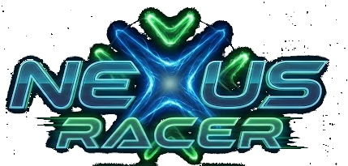

<div align="center">
  
  <p><strong>A browser flight game built on three.js.</strong><br>
  An endless, seed-deterministic low-poly world and three very different ways to fly it.</p>
  <p><em>Built for the OC AI Builders Lightning Hackathon — Monday, August 17, 2026</em></p>
</div>

---

```bash
npm install
npm run dev
```

Open the printed localhost URL. No build step, no backend, no external requests at runtime.

---

## Table of contents

- [What it is](#what-it-is)
- [Controls](#controls)
  - [On a phone](#on-a-phone)
- [The fleet](#the-fleet)
- [How it works](#how-it-works)
  - [Module map](#module-map)
  - [The procedural world](#the-procedural-world)
  - [Flight model](#flight-model)
  - [The virtual stick](#the-virtual-stick)
  - [The instrument set](#the-instrument-set)
  - [Combat and lock-on](#combat-and-lock-on)
  - [Garrisons, not roamers](#garrisons-not-roamers)
  - [Chill mode](#chill-mode)
  - [World scale and optics](#world-scale-and-optics)
  - [Model orientation](#model-orientation)
  - [Audio](#audio)
  - [Performance](#performance)
- [Asset pipeline](#asset-pipeline)
- [Dev tools](#dev-tools)
- [Adding assets](#adding-assets)
- [Bugs worth remembering](#bugs-worth-remembering)
- [Credits](#credits)
- [Licence](#licence)
- [Future improvements](#future-improvements)
- [Tech](#tech)

---

## What it is

Three modes share one world, one flight model and one fleet. They differ in what
the world is *for*.

| Mode | The loop |
|---|---|
| **Open** | Endless procedural world. Loot comes in rare **sites** — clusters you fly out and find — and the richest ones are **garrisoned**. Long quiet stretches punctuated by fights you choose to pick. |
| **Ring Race** | An infinite procedurally-generated gate track against five AI rivals. Gates buy you time; the clock is the only thing that ends the run. Weapons are legal. |
| **Chill** | No hostiles, no objectives, no clock, and nothing can end the run. Solitary pilots drift past on a shared heading and say hello. The HUD dissolves over a minute until only your marker and theirs remain. |

Open and Ring Race accept an optional goal (10 / 25 / 50 pickups or gates) or run
forever. Goal, assist level, sensitivity, audio and — on touch devices — the
steering mode all live behind the **gear** in the hangar dock, which keeps the
dock itself down to two controls so the hull gets the screen.

The world is generated from a fixed seed, so the same mountain range is in the
same place every session.

## Controls

| | |
|---|---|
| Mouse | **Virtual stick** — holds its deflection, so you can carry a bank through a full 180. Click the canvas to capture. |
| `X` | Recentre the stick |
| `W` / `S` | Throttle |
| `A` / `D` | Roll · `Q` / `E` rudder |
| `Shift` | Boost · `Ctrl` airbrake |
| `LMB` / `Space` | Primary weapon (auto-leads the locked target) |
| `RMB` / `F` | Secondary weapon (missiles seek the lock) |
| `T` | Cycle lock target |
| `R` | Signature ability |
| `C` | Camera — chase / far / cockpit |
| `M` | Mute · `Esc` pause |
| `[` / `]` | Nudge the hull's model facing · `\` resets it to auto-detected |

In the hangar: **click and drag the ship** to turn it over. Flick it and it keeps
the momentum; the turntable creeps back once you leave it alone. The **◀ / ▶**
pill under the hull steps through the roster and wraps at both ends — on a phone
the ship rail is off-screen, so that pill is the way through the fleet.

Every hull is warmed in roster order in the background from the moment the splash
appears, so picking one is instant rather than a download. It runs one fetch at a
time and parks itself whenever the player is waiting on something else; the
hairline along the bottom of the hangar tracks it and retires when the last hull
lands. The model cache keys on the *promise*, not the result, so a preload already
in flight and a selection asking for the same hull share one fetch.

### On a phone

Touch builds swap the mouse and keyboard for an on-screen deck. Steering has two
modes, set by the **Steering** chips in the hangar dock and remembered between
sessions:

| | |
|---|---|
| **Tilt** (default) | The gyroscope. Lean the handset to bank and dive. "Level" is however you were holding it at launch — **⊙** re-zeroes it any time. |
| **Touch** | Put a finger down anywhere on the left of the glass and move it around. The stick springs up under it, and follows if you walk past the ring. |

Both feed the same virtual stick the mouse drives, so the flight model and the
reticle never know the difference. The rest of the deck: the **THR** rail on the
left sets throttle, and **FIRE / MSL / ABL / BST / BRK** plus **TGT / CAM / ⊙ /
❚❚** sit bottom-right.

iOS only hands over the gyroscope from inside a user gesture, so the permission
prompt rides on the tap that picked Tilt (or on Launch, if you never touched the
option). If the handset has no gyro or the prompt is declined, it falls back to
touch steering and says so.

Detection needs **both** a coarse primary pointer and a touch digitiser, so a
laptop with a touchscreen keeps mouse-and-keyboard and its pointer lock. Force
the decision either way with `?touch=1` / `?touch=0`.

## The fleet

18 craft, each with its own accel / top speed / handling / boost / hull / mass
profile, a primary and secondary weapon, and a signature ability.

Designer-facing stats are 0–10 and resolve to physical simulation values in
`resolveStats()` — so tuning a ship means editing six numbers, not hunting
through the physics.

**Weapon archetypes** — pulse laser, rail laser, beam lance, vulcan machine gun,
scatter blaster, seeker missile, rocket pod, siege rocket. Each carries its own
damage, rate of fire, spread, heat cost, projectile speed and splash profile.
Heat, ammo and cooldown budgets differ per hull, so the same weapon feels
different depending on what it is bolted to.

**Signature abilities** include Phase Coil (i-frames + turn boost), Slipstream
(drag collapses), Aegis Shell (absorbs 300 damage), Overspin (double fire rate,
zero heat), Vortex Pull, Bumper Field, and Blink Drive — which on the Party
Monster reaches five times further than anyone else's.

Several craft share a base mesh and differ only by texture — re-skinned in
Meshy rather than modelled from scratch. See [Credits](#credits) for which ones.
Their stats and loadouts differ regardless, so they don't fly alike.

Two of the eighteen are **Training Wheels** craft (TW-H Humpty, TW-D Dumpty):
kids' toys with a flight licence, running at 62% top speed with heavy damping
and extra lift, for handing to someone who has never flown before.

## How it works

### Module map

| File | Role |
|---|---|
| `src/main.js` | Bootstrap, state machine, game loop, per-mode logic |
| `src/scale.js` | **All world scale in one place** — hull size, camera, optics, ordnance |
| `src/terrain.js` | Height field, biome colouring, chunked LOD streaming |
| `src/flight.js` | Fixed-timestep flight model |
| `src/ships.js` | Fleet roster, weapon archetypes, GLB loading and auto-orientation |
| `src/weapons.js` | Projectiles, missiles, beams, explosions, loadout state |
| `src/world.js` | Deterministic collectible sites, garrison AI |
| `src/race.js` | Endless track spline, gates, AI racers |
| `src/drifters.js` | Chill mode ambient traffic |
| `src/greetings.js` | 50 pilot hail lines and 20 callsigns |
| `src/environment.js` | Sky, sun, fog, water, clouds, sky-derived IBL |
| `src/hangar.js` | Menu backdrop — the hangar bay diorama and ship preview |
| `src/hud.js` | Splash, ship select, HUD, scanner, reticles, results |
| `src/input.js` | Keyboard, mouse and pointer lock |
| `src/touch.js` | On-screen thumb deck and gyroscope steering |
| `src/audio.js` · `src/soundbank.js` | Sample playback, classification, music rotation |
| `src/devgrid.js` | Dev-only model contact sheets |

### The procedural world

Terrain is a deterministic height field composed as `h = B + R + D − C`:

- **B** — continental mass from very low-frequency fBm, with domain warping so
  coastlines aren't obviously noise-shaped
- **R** — mountain ranges from *ridged* noise, gated by continental mass so
  ranges only form inland and read as ridges rather than isolated spikes
- **D** — high-frequency detail, kept subtle to preserve the low-poly silhouette
- **C** — river and basin carving

Noise is hash-based value noise with rotated-domain fBm (each octave rotates the
sample space ~0.7 rad) to break up the axis-aligned artefacts you otherwise get.

Chunks stream in a radius around the player at four LODs, budgeted to a couple of
builds per frame so generation never hitches. Geometry is non-indexed and
flat-shaded with per-face vertex colours; the diagonal of each quad alternates so
the faceting doesn't read as a regular grid. Downward **skirts** around each
chunk hide LOD seams without needing geomorphing.

Biome colour is a pure function of height, slope, moisture, temperature and a
stable low-frequency jitter — exposed rock appears on steep faces, snow only
sticks to shallow ones.

The sky is a gradient shader on a dome (no textures), and its material is run
through `PMREMGenerator` to produce the environment map — so the water and the
metal hulls reflect whatever time-of-day preset is running, and everything sits
in the same light.

### Flight model

Fixed 120 Hz timestep with bounded catch-up, decoupled from render rate.

Forces: gravity, engine thrust, quadratic drag, speed-dependent lift along body-up,
and slip damping that eases velocity toward the nose. Angular motion runs through
inertia and damping, with **bank-to-turn** — rolled attitude induces yaw
proportional to bank angle, which is what makes it feel like flying rather than
steering a cursor. Low airspeed collapses control authority into a soft stall.

Two assist levels: Assisted adds auto-level and gentler response; Standard keeps
full momentum.

### The virtual stick

This one went through three iterations and is worth explaining.

**v1** treated mouse movement as a roll *impulse*. The bug: mouse deltas are zero
the instant you stop moving, so auto-level immediately cancelled the bank and a
sustained turn — let alone a 180 — was impossible.

**v2** made the mouse drive a persistent virtual stick that holds its deflection.
That fixed turning and broke everything else: it was far too twitchy and
over-corrected constantly.

**v3** is what shipped. The stick still holds its deflection, but:

- sensitivity needs ~660 px of travel for full throw
- a 7% dead zone, then an **expo curve** (`t^1.85`) so fine movements near centre
  do almost nothing and full authority only arrives at the edges
- self-centring at 0.3/s — slow enough to carry a bank through a full turn, fast
  enough that an unattended ship levels out
- **the crosshair moves with the stick**, so deflection is visible and correctable.
  This was the actual missing piece: the control wasn't just mistuned, it was
  invisible.
- Low / Normal / High sensitivity in the hangar, persisted

Touch and tilt hang off the same stick, which is why they cost so little. Where
the mouse contributes *deltas* that accumulate, both mobile sources are
**absolute** — they write the stick's position directly, after the centring decay
and only while a finger is down or the gyro is live. So a held finger or a held
lean holds its bank exactly like a held mouse deflection, releasing hands the
stick back to the same self-centring, and the dead zone, expo curve, crosshair
feedback and sensitivity setting all apply unchanged.

Tilt is read as **gravity in screen space** rather than raw `beta`/`gamma`: the
device orientation is turned into a quaternion (the `DeviceOrientationControls`
frame fix), inverted, and applied to world-down. Roll is `asin(g.x)` — how far
gravity has moved toward the screen's right edge — and pitch is `asin(-g.z)` — how
far the glass has tipped away from vertical. Two properties fall out of that: it
works the same in portrait and landscape once `screen.orientation.angle` is folded
in, and `alpha` cancels exactly (it is a rotation about the world vertical, which
cannot move gravity), so a wandering magnetometer never shows up as drift. Both
angles are measured against a pose captured at launch, so "level" is however you
happen to be holding the handset.

### The instrument set

The HUD is icon-led: a glyph stands in for every label and unit, which is what
lets what used to be four panels of stacked text read at a glance at 500 m/s.
Speed is a speedometer and a number; boost, heat and hull are a glyph and a bar
each, and the *glyph* carries the warning colour so a dying hull registers before
any bar length has to be judged. Armament is three glyphs that say ready, spent
or cooling by colour alone.

Weapon names left the HUD entirely. They are fixed by the hull you chose two
screens ago, so printing them every frame spends pixels telling you something you
already know; they survive as tooltips on desktop and in the hangar's spec sheet.
The mode label went the same way — the clock is the only thing the top banner
carries unless there is genuinely something to say.

Mobile drops another layer: the scanner legend teaches the dot colours once and
then costs a corner forever, the race board narrows to a three-row window around
the player instead of the whole grid, and only the *locked* contact gets a text
label — at race speeds five names and ranges stack into one smear over your own
ship. Brackets still mark every contact.

Icons come from [game-icons.net](https://game-icons.net) rather than a general UI
set, because a set drawn for games has a speedometer, an afterburner, a drag
chute and a gyroscope in it — and those read as this game rather than as a
dashboard. They are baked into `src/icons.js` by `scripts/icons.mjs`; the 4134-icon
package stays a devDependency, since name-keyed runtime lookups cannot be
tree-shaken. Each one was checked at 16px on the HUD's dark ground first, which
rejected several obvious-sounding picks — `thermometer-hot`, `missile-swarm`,
`crystal-cluster` and `jet-fighter` all turn to mush at that size.

### Combat and lock-on

A sticky lock picks whatever hostile sits closest to the nose inside a ~26° cone
and holds it until something is clearly better centred (by 0.05 dot) or you cycle
with `T`. Guns, lasers *and* the beam auto-lead the target's intercept point via
a two-iteration fixed-point solve, blended by lock confidence. Missiles seek it.

The targeting overlay is a single 2D canvas: corner brackets, range, hull pip,
rival name, a closing-then-steady lock ring, and an edge arrow when the locked
target slips behind you. It renders *under* the HUD panels so it never fights
them for space.

### Garrisons, not roamers

The first version had hostiles hunting the player globally, which produced two
problems: at 500 m/s you blow past them and they can never catch up, and the sky
was never quiet.

The shipped design ties hostiles to **loot**. Guarded sites hold a garrison that
patrols a slow orbit, wakes only when you come within 4.2 km, and is leashed to
5.2 km so it can never be dragged off its post. Downed guards only return if the
site still has loot worth guarding. The result is the rhythm the game wanted:
long stretches of flying, then a fight you flew toward on purpose.

### Chill mode

Everything hostile is switched off, and a terrain scrape bounces you back up
instead of wrecking you — nothing ends the run.

Ambient traffic shares one **slowly wandering heading** so the sky reads as a
loose migration rather than random noise, while each craft carries its own lane
offset, altitude band, speed and weave so it never looks like a formation. They
are scattered wide and deep, so encounters are solitary.

Come within 2.2 km and you get a hail — one of 50 lines, from a named pilot.
There is no lock and no threat read, just a calm blue range figure.

The HUD then does something slightly unusual: over 60 seconds it dissolves
*selectively*. The scanner is drawn as two independently-alpha'd layers, so the
dish, rings, sweep, rim and every panel fade to nothing while the **contacts and
your own marker hold**. What's left is your position relative to everyone else,
and nothing else.

### World scale and optics

Every scale constant lives in [`src/scale.js`](src/scale.js). Hulls are
deliberately oversized — capital ship, not fighter jet — because the models are
the best-looking thing in the game and hiding them at realistic scale was a bad
trade.

The important part is that the camera pulls back **less than linearly** with hull
size (roughly 6× against a 10× hull) and the field of view is tighter than a sim
would use. A bigger ship therefore genuinely fills more of the frame instead of
just sitting further away. The hangar preview is its own diorama with its own
display scale, independent of in-flight size.

### Model orientation

Meshy exports don't agree on which way is forward, and a ship flying backwards or
sideways ruins the whole thing. Rather than eyeballing 18 models, orientation is
**derived from geometry** in `detectForwardYaw()`:

1. Voxelise the hull into a coarse occupancy grid.
2. Aircraft are mirror-symmetric across the plane containing their length axis,
   so reflecting along the *lateral* axis maps the hull onto itself. Whichever
   horizontal axis reflects with less error is lateral; the other is length.
3. Hulls taper toward the nose, so of the two ends of the length axis, the one
   with less occupied volume is the front.

This gets 17 of 18 right. For the holdout there's `modelYaw` in the roster, plus
a four-yaw comparison tool (below) so the answer is measured rather than guessed.

**Convention:** every ship noses down **−Z**. Use
`quaternion.setFromUnitVectors(FWD, dir)` to aim one — never `Object3D.lookAt`,
which aims **+Z** and will fly the hull tail-first.

### Audio

All audio is sample-based; there is no synthesised fallback. Clips are classified
by filename keyword, so dropping files in and re-running `npm run sounds` wires
them up.

Two details worth noting:

- **Music rotates.** Each track plays to the end, then the next in a reshuffled
  order takes over, and a restart never opens on the track it just played.
  Chill mode has its own pool.
- **Rapid fire is gated.** A vulcan asks for a sample every 55 ms, which phases
  into mud and stacks gain until it clips. Guns fire one clip per 110 ms with
  ±22% pitch spread, capped at three concurrent voices, and each extra voice is
  gain-trimmed. It reads as a burst instead of a wall.

### Performance

Nothing is allocated during play. Combat pools are built up front (110 bolts, 28
missiles, 90 flares, 4 beams) and `renderer.compile()` runs before anything is on
screen. Hostiles are a **fixed pool** — death hides the mesh and starts a respawn
timer; it never destroys and re-clones a GLB.

Measured across five kills: median frame 16.6 ms, max 22.8 ms, **zero frames over
33 ms** — identical to idle.

The render loop also draws the world *before* the HUD and wraps the HUD in a
try/catch, so a broken gauge can't blank the game.

## Asset pipeline

```bash
npm run optimize          # models + audio, idempotent
```

`public/` ships at ~19 MB, down from ~146 MB:

| | before | after | |
|---|---|---|---|
| Models (18 GLB) | 128.3 MB | **8.1 MB** | −93.7% |
| Audio (16 MP3) | 17.3 MB | **10.9 MB** | −37.0% |

Inspection came before optimisation, and it changed the approach: the hulls are
~97% texture by weight — three 2048×2048 JPEGs against a ~230 KB mesh. Draco
compresses *geometry*, so it would have bought almost nothing here while forcing
a decoder into the runtime. Resizing textures to 1024 and re-encoding as WebP
does effectively all the work.

The script deliberately does **not** run `simplify` or `quantize`. They saved a
further ~76 KB per model in exchange for altering geometry whose orientation and
silhouette had already been verified — not a trade worth making before a demo.
Net result: zero geometry bytes changed, and no loader changes either, since WebP
in glTF rides on `EXT_texture_webp` which three's `GLTFLoader` reads natively.

Originals are copied to `assets_src/` (gitignored, not served) before anything is
overwritten, so the step is reversible and safe to re-run.

## Dev tools

| URL | What it does |
|---|---|
| `/?grid=1` | Contact sheet of every hull. A correctly oriented ship points **left**. |
| `/?grid=1&from=9&count=9&cols=3` | Paged contact sheet |
| `/?grid=1&yaws=butter-rocket` | Renders one hull at all four cardinal yaws so the correct one can be read off directly, then pinned via `modelYaw` |

`window.__game`, `window.__three`, `window.__audio` and `window.__touch` are
exposed for console tuning.

## Adding assets

**Models** — drop a `.glb` in `public/models/`, add an entry to `SHIPS` in
[`src/ships.js`](src/ships.js), then run `npm run optimize`. Orientation is
auto-detected; override with `modelYaw`, or nudge it live in flight with
**`[`** / **`]`** (**`\`** resets to auto-detected). An explicit `modelYaw` wins
over a stale manual nudge. `sizeMult` scales one hull against the fleet.

**Sounds** — drop clips in `public/sound/` and run `npm run sounds` (also run by
`npm run dev`). Classified by keyword: `bgmusic4`/`bgmusic5`/`lofi`/`chill` →
Chill pool, `bgmusic*`/`music` → main theme pool, then `boost`,
`whoosh`/`gate`, `laser`/`shot`, `missile`, `explosion`, `pickup`/`ring`,
`hurt`, `ui`. Anything unrecognised is spread across the events that most need a
clip. The script also renames files containing URL-hostile characters like `#` —
Vite silently serves `index.html` instead of those.

## Bugs worth remembering

A few of these cost real time and have non-obvious causes.

- **Missiles flew backwards.** Not a guidance bug. `m.vel.copy(_v2).multiplyScalar(m.vel.length())`
  overwrites `m.vel` *before* reading its length, so speed reset to 1 every frame
  and the missile never accelerated past 16 m/s — you simply outran it. Capture
  the magnitude before touching the vector.
- **Enemies flew tail-first.** `Object3D.lookAt` aims **+Z** at the target, but
  every hull noses **−Z**.
- **A hitch on every kill.** It looked like the explosion; it was the *respawn*
  deep-cloning a GLB and building two fresh geometries and materials mid-frame.
- **Black collectibles.** `vertexColors: true` on an `InstancedMesh` makes the
  shader look for a per-vertex colour attribute the geometry doesn't have, so it
  reads black. Instanced colours work *without* it.
- **A HUD exception blanked the game.** An error thrown in `renderHUD` skipped
  `renderer.render`, leaving the last frame on screen — which looked exactly like
  a stale build.
- **A global `canvas` CSS rule** yanked the radar's 2D canvas to the viewport
  corner. Scope selectors to `#app canvas`.
- **`#menu > *` out-specifies `.stage`.** ID-prefixed selectors beat bare classes,
  which is why the hangar drag silently did nothing.

## Future improvements

**World**
- Move terrain generation into a Web Worker — currently on the main thread and
  budgeted, which works but caps how fast you can travel before chunks lag
- Floating origin for very long flights (precision drifts past ~1e6 units)
- Biome-specific props: trees, settlements, airstrips, landmark structures
- Weather systems — rain volumes, wind that actually pushes the ship

**Gameplay**
- Persistent progression: unlock hulls, upgrade stats between runs
- Race mode variants — time trial ghosts, elimination, checkpoints with branching
  routes
- Co-op or ghost multiplayer; the drifter system is most of the scaffolding for a
  networked pilot already
- Damage states on the hull mesh rather than just a hull bar
- Landing and takeoff at settlements

**Feel**
- Hull-relative camera shake and G-force effects on the cockpit view
- Doppler and positional audio for passing craft (`PannerNode`)
- Engine audio that responds continuously rather than on boost transitions
- Controller support — the virtual stick maps naturally to an analogue stick, and
  the touch layer already proves a third input source can feed it
- Haptics on the touch deck (`navigator.vibrate`) for lock-on and gate hits

**Technical**
- KTX2 / Basis for textures (another ~2× over WebP, at the cost of shipping a
  transcoder)
- Instanced rendering for drifters and garrison hostiles
- A proper settings menu: render scale, draw distance, quality presets, key rebinding
- Automated visual regression on the contact sheet, so a model change that breaks
  an orientation fails loudly

## Tech

three.js · Vite · vanilla JS, no framework · Web Audio API · `@gltf-transform/cli`
and `ffmpeg` for the asset pipeline. No runtime network requests — everything is
local, so it works on venue wifi or none at all.

## Credits

Created by **Grant Walker** — [LinkedIn](https://www.linkedin.com/in/beardedbestie)

Built with:

- [Claude Code](https://claude.com/claude-code) (Opus 5) — code
- [Meshy](https://www.meshy.ai/?utm_source=workshop&utm_medium=referral-program&utm_content=R35HU7&share_type=invite-friends) — ship models
- [Suno](https://suno.com/invite/@beardedbestie) — music
- [Midjourney](https://www.midjourney.com/) — logo and art direction
- [ElevenLabs](https://try.elevenlabs.io/gbmvamvgnr30) — sound effects
- [game-icons.net](https://game-icons.net) — HUD icons, by Lorc, Delapouite and
  contributors, licensed [CC BY 3.0](https://creativecommons.org/licenses/by/3.0/)

**A note on the fleet:** several of the 18 craft share a base mesh and differ
only by texture — they were re-skinned in Meshy rather than modelled separately.
Emerald Serpent and Dark Dragon are the same hull, as are Sugarblade and Nimbus
Floss, the two Rustwings, the two Skyblades, and the two Training Wheels toys.
It's a deliberate trick: a re-skin costs a fraction of a fresh generation and
reads as a distinct ship in flight, which is how the roster got to 18 in a
single day. The stat lines and loadouts differ, so they play differently even
where they look related.

## Licence

Released under [CC0 1.0 Universal](LICENSE) — public domain dedication. Do
whatever you like with it: copy it, modify it, ship it commercially, no
attribution required. Credit is welcome but not owed.

Two caveats worth knowing, since CC0 can only waive rights the author actually
holds:

- **Dependencies keep their own licences.** three.js is MIT and its notice must
  be retained in redistributions.
- **The HUD icons are CC BY 3.0, not CC0.** `src/icons.js` is baked from
  [game-icons.net](https://game-icons.net) (Lorc, Delapouite and contributors).
  That licence *does* require attribution, so if you strip the credits above,
  strip the icons too.
- **Generated assets are governed by the terms of the tool that made them.**
  The models, music, logo and sound effects came out of Meshy, Suno, Midjourney
  and ElevenLabs, and what you may do with them depends on those services'
  terms and the plan they were generated under — not on this repository's
  licence.
